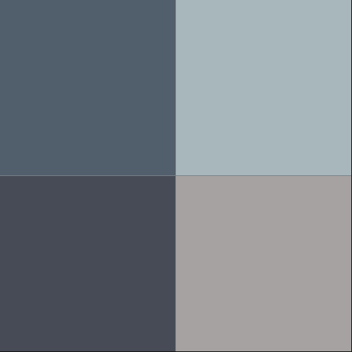
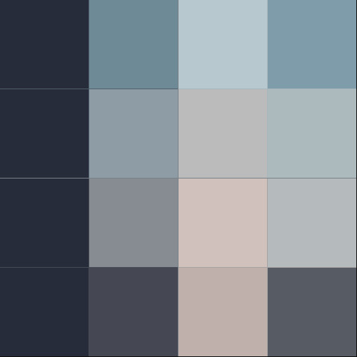
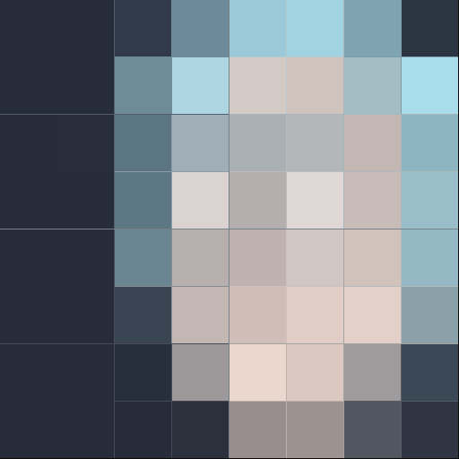
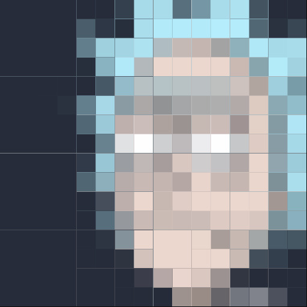
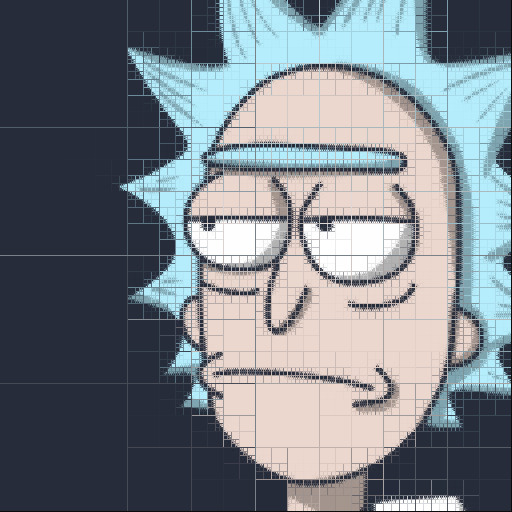
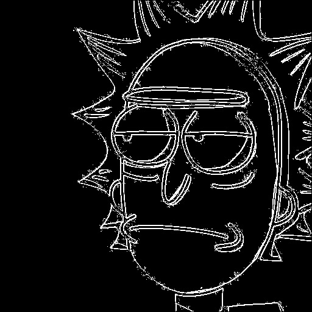

# quadtree-ppm-java
A Java program to analyze PPM format (Portable Pixmap Image File) images and change them into modified versions of them by methods: compress (not by size but view), greyscale, negative and edge detection.

This program is written in order to understand and use QuadTree data structure, as a computer science assignment. This data structure is also written by myself, any tree library of Java is not used.

### Compilation and run:

Standart java compilation with the main class name which is Driver.java, with 5 arguments.

```
  ~$ javac *.java
```

As arguments, it is essential that number of them will be exactly 5, as follows:
- An input file name which is the .ppm format image, exactly after a flag -i. Input file must contain ".ppm" at the end.
- An output file name, exatcly after a flag -o. This sould not be appended by ".ppm"
- To get 8 compressed versions of the image, one of the arguments must be -c
- To get edge-detected version of the image, one of the arguments must be -e
IMPORTANT: -c and -e must not be used together. Each command has to contain one of them each time.
- Order of the flags do not matter, as long as -i and -o are followed by their proper file names.

So:

```
  ~$ java Driver -i inputExample.ppm -c -o -outputExample
  ~$ java Driver -i inputExample.ppm -e -o -outputExample
```

### Known bugs and limitations:

- Program execution takes a very long time. For instance, getting 8 compressed versions of a 512x512 file takes approximately 10-16 minutes (i7 CPU). It means one process, including edge detection, takes nearly 1-2 minutes.
- I did not control how many times or how many depth node I get while printing 8 compressed files. Program, prints automatically 4, 4^2, 4^3... 4^8 smallest necessary squares. That means, if the image is small enough, at some point program may prints images that have same resolution. Or, in the opposite situation, even 8th version could not reach the highest resolution (the case that tree's smallest square = 1 pixel). But all can be handled. 4^j values in the for loop can be changed in my Driver program where the part beginning "j values can be changed willingly". It is 1<=j<9 by default.
- Threshold value is 5 by default. Prints proper images when it is like that. It can be changed, either.

### Exapmle Input and Outputs

[ GitHub does not open big ppm images, therefore I put converted to jpg versions of the input and the outputs. ]

Original file (input):


8 compressed steps:












Negative:


Monochromatic (greyscale):


Edge Detection:

This type of images are being used in big data storages.


